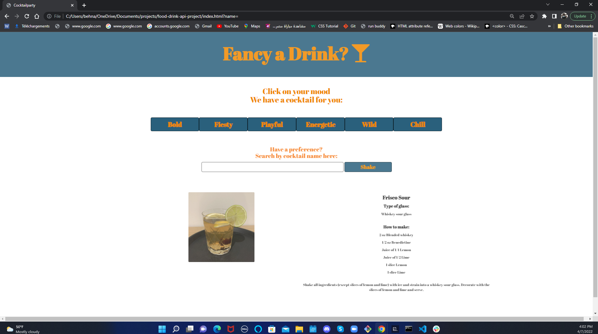

# project-idea : Cocktail Buddy!

* This is the first group project in CWRU's coding bootcamp.
## User Story:
As a consumer of various cocktails, I want a simple way to find cocktail recipes by name, So that I can quickly make drinks and know what I need for that drink

## Discription:
 An application that helps users find new cocktail ideas and recipes depending on the users mood or the user is able to search from their favorite drink to find their recipe!

## Motivation :
- Our motivation for this application is to help users who are looking for new cocktail ideas and recipes.

## Screenshots:

## Tech/framework used
<b>Built with</b>
- Html
- CSS
- JavaScript
- Jquery
- bootstrap

### Website: https://tljurecki.github.io/project-idea/
### Github repository: https://github.com/tljurecki/project-idea.git

### API Reference:
The Cocktail DB: https://www.thecocktaildb.com/api.php

## Future Development Plans :
<b>Future enhancements to this app include:</b>
 - Adding the ability to save and categorize cocktails.
 - Allow users to search for cocktails by preferred liquor
 - Adding the ability to get a meal suggestion to best pair cocktails with food.
- Allowing users to access their saved cocktail recipes offline

## Contribution
<b>this project is made by :</b>
- Tanya Jurecki
- Kyle Geary
- Nick Bross 
- Mohamed Behnas 

 
 

